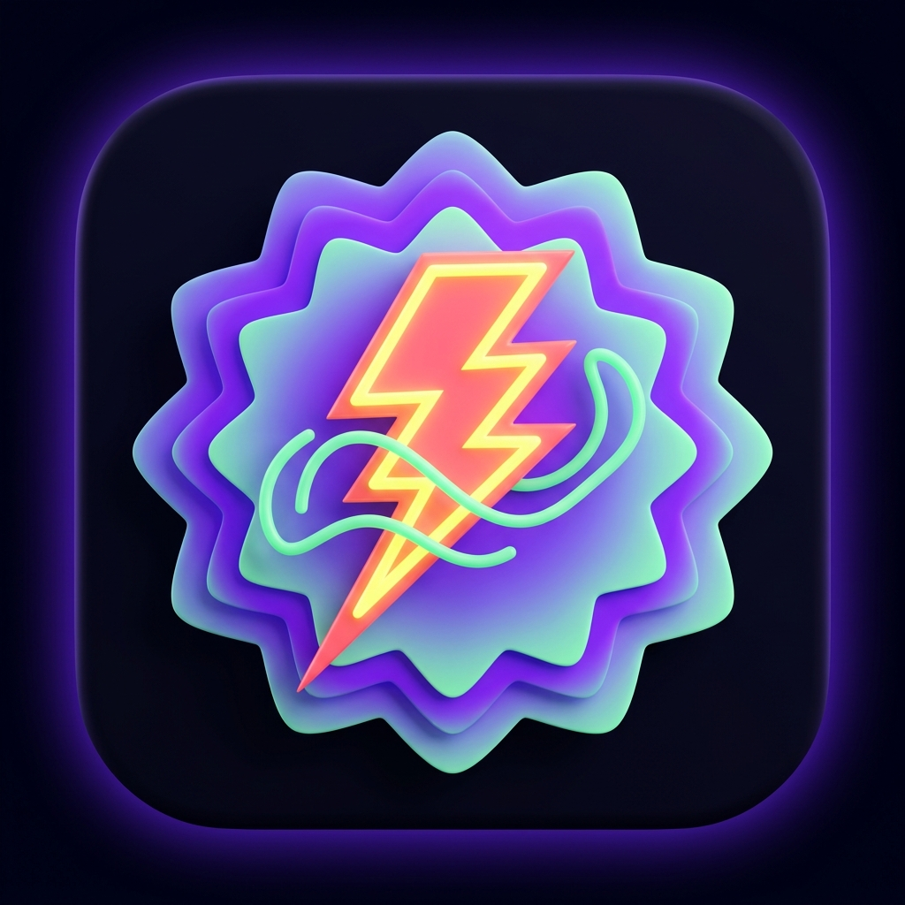

  

<h1 align="center">SourZap</h1>

  <b>High-speed, rootless DPI packet circumvention & network monitor for Android.</b> 
  Built with pure Kotlin, native <code>VpnService</code> user-space packet filtering, and Google's Material 3 Expressive design system.

  
  
  
  
  

---

## 📌 The Problem

Modern ISPs and state-level middleboxes employ Deep Packet Inspection (DPI) to identify, throttle, or block access to services like YouTube (restricting video playback to 360p/480p), Discord (blocking voice RTC gateways and websockets), and independent web platforms.

While tools like **Zapret** and **ByeDPI** exist on desktop and Linux routers to defeat these middleboxes by desynchronizing TCP handshakes, using them on Android historically required **root access**, custom kernels, or running convoluted terminal scripts inside Termux.

## ⚡ How SourZap Solves It

**SourZap brings full DPI packet evasion to non-rooted Android devices.**

Using Android's native VpnService interface (10.0.0.2/24), SourZap runs an in-process, high-speed packet inspection and desynchronization engine. It captures initial handshake packets directly in user space, applies targeted desynchronization strategies, and transparently streams payload data at maximum line speed (>500 Mbps – 1 Gbps+).

---

## 🚀 Key Features

- **No Root / No Termux Required**: Operates transparently as a standard Android VPN service with one-tap activation.
- **Zapret DPI Evasion Engine**:
  - **TLS ClientHello Splitting**: Slices ClientHello packets across discrete TCP frames right at the SNI boundary with TCP_NODELAY.
  - **Fake SNI / Low-TTL Packet Injection**: Injects low-TTL dummy ClientHello frames (www.google.com, cloudflare.com) that expire before destination servers but poison middlebox DPI caches.
  - **TCP Disorder**: Emits packet segments out-of-order so middlebox state trackers fail while the target server's OS TCP stack reassembles them normally.
  - **HTTP Host Casing & Space Injection**: Randomizes header casing (hOst:) and inserts header delimiters.
  - **QUIC / UDP 443 Policy**: Blocks UDP QUIC packets to trigger immediate fallback to TCP where packet desync applies.
- **DNS-over-HTTPS (DoH)**: Integrated multi-provider DoH resolver (Cloudflare, Google, Quad9, AdGuard) preventing ISP DNS poisoning and Geo-blocking.
- **Turbo Speed Architecture**:
  - ByteArrayPool lock-free 64KB recycled buffer system preventing Garbage Collection (GC) pauses during heavy 4K streaming.
  - 512KB socket window buffers with IPTOS_THROUGHPUT kernel prioritization.
  - Fast-path handshake detection: steady-state streaming transfers directly between socket channels without regex or string overhead.
- **Real-Time Traffic Monitor & Speed Test**:
  - Live download and upload throughput meters with animated smooth waveform graph.
  - Built-in multi-stream Internet Speed Test (Ping, Jitter, Download, Upload).
  - Real-time Connection Inspector stream showing intercepted domains, protocols, and applied bypass techniques.
- **Material 3 Expressive UI**:
  - Built with Google's research-backed Material 3 Expressive design system.
  - Scalloped 12-petal starburst status badges, organic rotating breathing rings around the hero toggle, asymmetric squircle cards, and high-contrast vibrant palettes.

---

## 🎯 Preconfigured Bypass Strategies

| Preset | Target Use Case | Evasion Techniques |
|---|---|---|
| **YouTube Turbo Fix** | Restores smooth 4K/1080p 60fps streaming on throttled ISPs | Fake SNI (www.google.com) + SNI Start Splitting + TCP Disorder + QUIC Blocking + DoH |
| **Discord & RTC Fix** | Unblocks Discord Gateway, WebSockets, API & Voice streams | TLS Split (Pos 2) + TCP Disorder + Cloudflare DoH |
| **Universal DPI Bypass** | General anti-censorship preset for blocked web services | Multisplit + Low TTL Fake Packets + HTTP Host Header Casing |
| **Aggressive Anti-Censor** | Heavily filtered networks with strict deep-packet firewalls | Multi-segment TLS fragmentation + OOB + Quad9 DoH |
| **Custom Configurator** | Power users & researchers | Configurable split offsets, fake SNI strings, TTL stepper (1–12), disorder toggle, and DoH selection |

---

## 📱 Screenshots & UI Design

  

The user interface follows Google's latest **Material 3 Expressive** research:
- **Expressive Shapes**: 12-petal scalloped badges, asymmetric container geometry, and wavy breathing rings.
- **Tactile Hero Connect Button**: Oversized 230dp tactile control with spring-physics feedback.
- **Speedometer Arc Gauge**: 240-degree gradient speedometer with live needle interpolation.
- **Floating Expressive Dock**: Pinned bottom navigation dock with soft pill containers and bouncy active indicators.

---

## 📥 Download & Installation

### Option 1: Download Pre-built APK (Recommended)
Grab the latest release from the [GitHub Releases Page](https://github.com/Sourish25/SourZap/releases).

### Option 2: Build from Source
Requirements: JDK 17, Android SDK (API 34/35).

`ash
# Clone the repository
git clone https://github.com/Sourish25/SourZap.git
cd SourZap

# Run unit tests
./gradlew testDebugUnitTest

# Assemble debug APK
./gradlew assembleDebug

# Output APK will be at:
# app/build/outputs/apk/debug/app-debug.apk
`

---

## 🤝 Contributing

We welcome contributions from the community! Whether you want to add new DPI bypass presets for specific regional ISPs, improve socket streaming performance, or refine the Material 3 Expressive UI components:

1. **Fork the repo** and create a feature branch (git checkout -b feat/my-feature).
2. Make your changes and ensure unit tests pass (./gradlew testDebugUnitTest).
3. Open a **Pull Request** explaining your changes.
4. All PRs are reviewed and must pass CI builds before merging into main.

Please read our [Contributing Guidelines](CONTRIBUTING.md) and [Code of Conduct](CODE_OF_CONDUCT.md) for full details.

---

## 🛡️ Security & Privacy

SourZap is strictly a user-space network bypass and telemetry utility:
- **Zero Data Logging**: Your traffic is processed locally in memory on your device. Nothing is sent to external tracking servers.
- **Protected Sockets**: Local socket connections are protected via Android's VpnService.protect().
- **Encrypted DNS**: All DNS queries are resolved over encrypted HTTPS (DoH).

To report a vulnerability, please refer to [SECURITY.md](SECURITY.md).

---

## 📄 License

SourZap is licensed under the [MIT License](LICENSE).